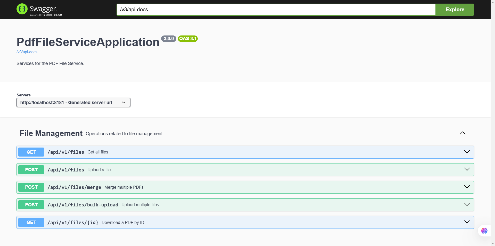

# PDF File Service 📄✨

## Description 📝

This project provides a set of services for managing PDF files, including merging. It's built using Spring Boot and provides a REST API for easy integration with other applications. 🚀

## Purpose 🎯

The main goal of this service is to offer a reliable and efficient way to handle PDF-related tasks. You can use it to merge multiple PDF files into a single document. 🤝

## Libraries Used 📚

*   Spring Boot 
*   Swagger (OpenAPI) 

## Additional details
It includes logs, global exception handler, unit tests, and integration tests to ensure the reliability of the service. The service is designed to be easily extendable for future features. 🔧

## Getting Started 🚀
To run the application, follow these steps:
1. Clone the repository:
```bash
git clone
```
2. Navigate to the project directory:
3. Build the project:
```bash
mvn clean install
```
4. Run the application:
```bash       
 mvn spring-boot:run
``` 
5. Access the API documentation at:
6. Swagger UI: [http://localhost:8080/swagger-ui.html](http://localhost:8181/swagger-ui.html)


